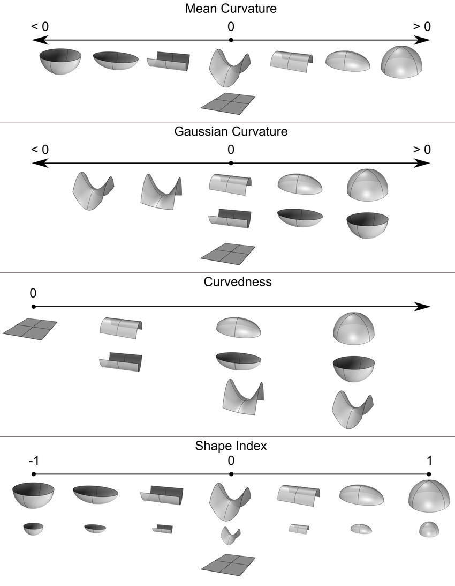

# Overview

Topology descriptors are designed to capture subtle sharpness and curvature differences along the surface of diseased pathologies on imaging.

These are based on the hypothesis that local structural changes through infiltration and disruption of disease in a region is likely to cause shape irregularities and in turn, resulting in changes along the surface of the lesion.

# References

If you make use of this implementation, please cite the following paper:

Ismail, M., Hill, V., Statsevych, V., Huang, R., Prasanna, P., Correa, R., Singh, G., Bera, K., Beig, N., Thawani, R. Madabhushi, A., Aahluwalia, M, and Tiwari, P., "Shape features of the lesion habitat to differentiate brain tumor progression from pseudoprogression on routine multiparametric MRI: a multisite study". American Journal of Neuroradiology, 39(12), pp.2187-2193.

# Getting started with topology radiomics

## Installing using pip

You can find our package on pypi

Run the below command to install the package:

```
pip install topology_radiomics
```

## Running with docker

First clone this repository

```
git clone https://github.com/radxtools/topology-radiomics.git
```

There are multiple ways to get started.

1. docker-compose
2. docker run

### docker-compose

Run the following commands to start the docker container

```
cd docker
docker-compose up
```

### docker run

With this step, you don't need to clone the url.
Run the following commands to start the docker container

```
docker rm radxtools/topology-radiomics-examples
docker pull radxtools/topology-radiomics-examples
docker run -d -p 3000:3000 --name topology-radiomics-examples radxtools/topology-radiomics-examples
```

## Tutorials

Once the docker image is up and running. You can view our notebooks. You can get started with the notebook to learn how to use the package. You should start with `Tutorial - Getting started with topology_radiomics.ipynb`

Tutorial Notebooks:

1. Tutorial - Getting started with topoplogy_radiomics.ipynb
2. Tutorial - Using topology_radiomics to visualize features.ipynb
3. Tutorial - Working with medpy and topology_radiomics.ipynb

The notebooks can be viewed by opening the browser and visting the url http://localhost:3000

**Note:** topology_radiomics clips outliers a per lesion basis. See the tutorials for more information.


# Contribution Guide:

Please follow google style formatting for [docstrings](https://google.github.io/styleguide/pyguide.html#38-comments-and-docstrings)

## Bugs and Feature Request

Please submit bugs and features to our github page.


## Pull Requests
Create a issue on our board.
Create a pull request with your changes. Tag your changes with the issue number (commit message should have issue number).
Someone from the team will review your request and merge your changes for the next release.

# Characteristics of Curvature

The topology of surfaces in imaging can be quantified with gaussian curvature and mean curvature. The following 4 surface measures are derived from the gaussian and mean curvatures:
- Curvedness
- Shape Index
- Sharpness
- Total Curvature

The figure below highlights characteristics of the gaussian and mean curvatures, as well as some of the surface measures.

<a href='https://www.researchgate.net/publication/307303825_Heritability_maps_of_human_face_morphology_through_large-scale_automated_three-dimensional_phenotyping'></a>

This figure was adapted from:

<div align='center'>Tsagkrasoulis, Dimosthenis & Hysi, Pirro & Spector, Tim & Montana, Giovanni. (2016). Heritability maps of human face morphology through large-scale automated three-dimensional phenotyping. Scientific Reports. 7. 10.1038/srep45885.</div>
